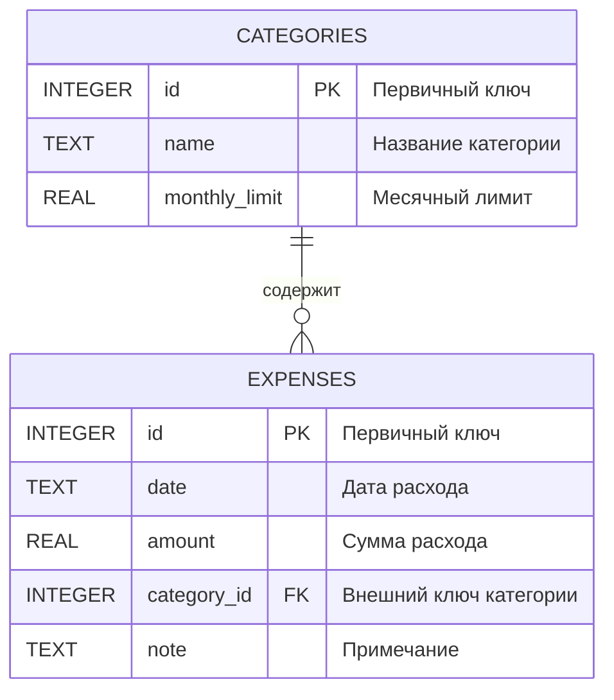

# ER-диаграмма

## Сущности

- `CATEGORIES` — категории расходов с установленными лимитами.
- `EXPENSES` — записи о расходах, относящиеся к определенной категории.

## Связи

- Одна категория может содержать несколько расходов.
- Каждый расход принадлежит одной категории.
- При удалении категории автоматически удаляются все связанные расходы (`ON DELETE CASCADE`).