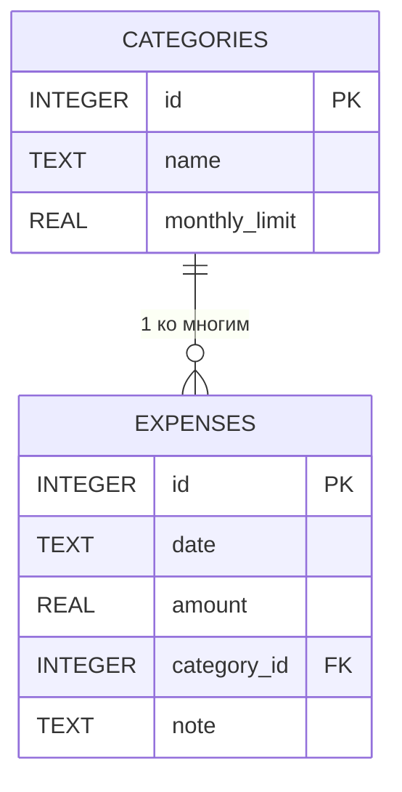

# Логическая схема базы данных

## Таблицы и поля
### CATEGORIES

- `id` — PK
- `name` — уникальное название категории
- `monthly_limit` — месячный лимит расходов

### EXPENSES

- `id` — PK
- `date` — дата расхода
- `amount` — сумма расхода
- `category_id` — FK на `CATEGORIES(id)`
- `note` — примечание к расходу

## Связи

- Одна категория может содержать несколько расходов.
- Каждый расход принадлежит одной категории.
- При удалении категории все связанные расходы удаляются автоматически (`ON DELETE CASCADE`).